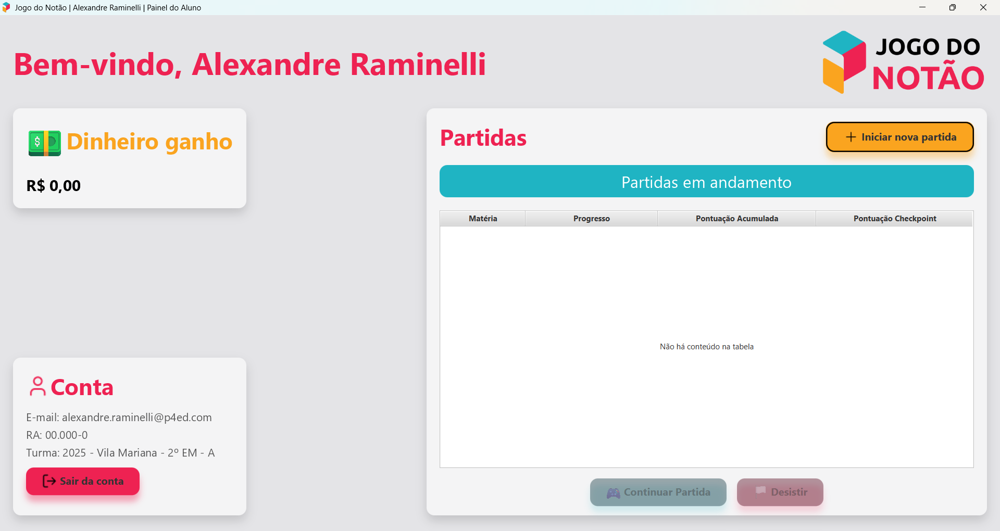
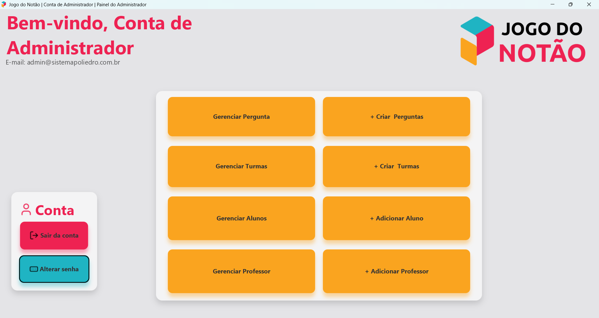
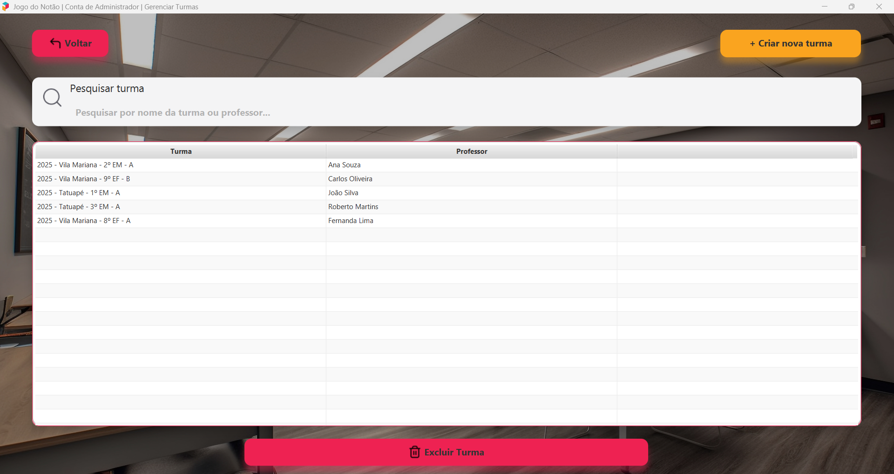
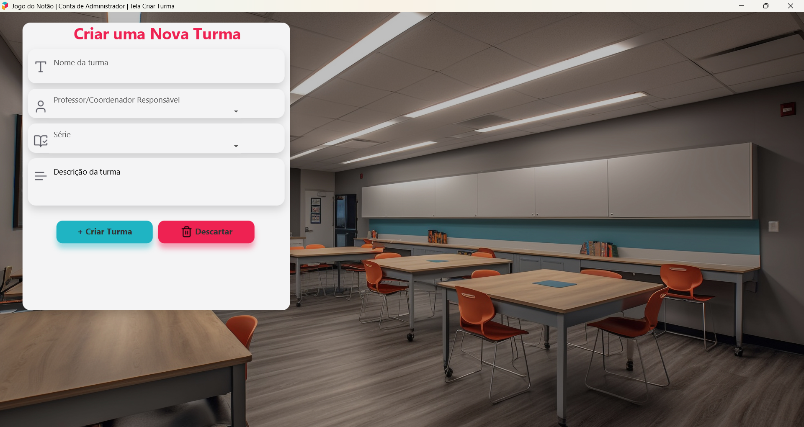
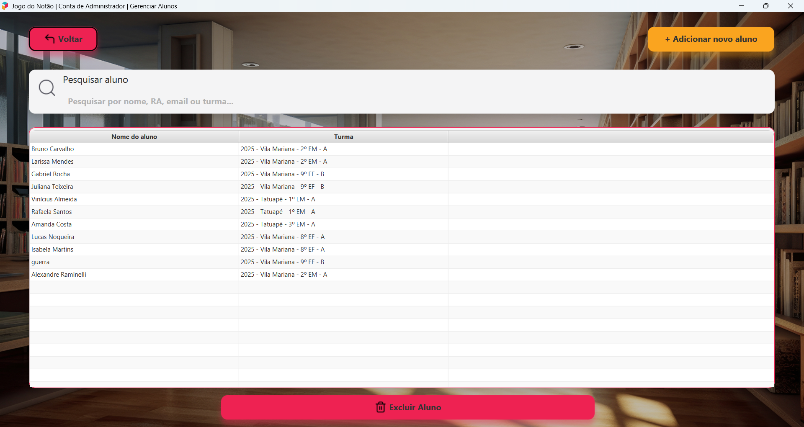
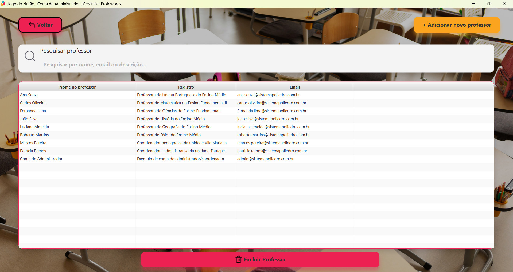

<h1 align="center">
    Projeto Integrador Interdisciplinar:<br>
    Desenvolvimento de jogo educacional para o Colégio Poliedro<br>
    Jogo do Notão
</h1>

<!-- Introdução -->
<p align="justify">Este projeto universitário foi desenvolvido como parte da disciplina <strong>Projeto Integrador Interdisciplinar - Programação (TTI105)</strong> dos cursos de <strong>Ciência da Computação</strong> e <strong>Inteligência Artificial e Ciência de Dados</strong> do Instituto Mauá de Tecnologia.</p>
<p align="justify">O projeto visa desenvolver um jogo educacional para o <strong>Colégio Poliedro</strong> baseado no clássico jogo Show do Milhão. O jogo consiste em perguntas de múltipla escolha onde a cada resposta o aluno ganha uma recompensa e a dificuldade das perguntas vai aumentando. O principal objetivo do jogo é incentivar o estudo dos alunos.</p>

<!-- Parceria -->

## 🤝 Parceria

<p align="center">Este jogo foi desenvolvido por alunos do <strong>Instituto Mauá de Tecnologia</strong> em parceria com o <strong>Colégio Poliedro</strong>.</p>
<div align="center" style="display: flex; flex-direction: row; align-items: center; width: 100%; justify-content: center; gap: 16px; flex-wrap: wrap;">
    <!-- IMT -->
    <a href="https://www.maua.br/images/logo-IMT.png" target="_blank">
        
    </a>
    <!-- Poliedro -->
    <a href="https://www.colegiopoliedro.com.br" target="_blank">
        
    </a>
</div>

<!-- Integrantes -->

## 🧑🏻‍💻 Integrantes do Projeto

|                               Aluno                               |     RA     | Função |
| :---------------------------------------------------------------: | :--------: | :----: |
|   [Alexandre Raminelli](https://github.com/alexandreraminelli)    | 24.01625-0 |        |
| [Felipe Eros Bressani Bittencourt](https://github.com/FelipeEros) | 25.00262-7 |        |
|          [Gabriel Borges](https://github.com/Gab250169)           | 25.01694-0 |        |
|        [Patrick Gomes de Sousa](https://github.com/Pgs-0)         | 25.01699-9 |        |
| [Vinicius Cavalcante Tavarez](https://github.com/viniciusct0626)  | 25.01685-8 |        |

---

<!-- Tecnologias -->

## 🛠️ Tecnologias Utilizadas

### Linguagens e bibliotecas

- [Java 24](https://www.oracle.com/java/technologies/downloads)
- [JavaFX](https://openjfx.io/)

### IDE e controle de versionamento

- [IntelliJ Community](https://www.jetbrains.com/idea/download/)
- Git
- GitHub

---

## 🔧 Requisitos

### Para execução

- [Git](https://git-scm.com/downloads) (para clonar o repositório)
- [Java Development Kit (JDK)](https://www.oracle.com/br/java/technologies/downloads/) - 24 ou superior

### Para desenvolvimento

- [IntelliJ IDEA](https://www.jetbrains.com/idea/download/) (para abrir o projeto)
- [Scene Builder](https://gluonhq.com/products/scene-builder/)

## 🚀 Como executar o projeto

### 1. Clonar o repositório

Clone o repositório executando o seguinte comando no seu terminal:

```bash
git clone https://github.com/Jogo-do-Notao/jogo-do-notao.git
```

### 2. Abrir projeto no IntelliJ IDEA

No IntelliJ IDEA, execute os seguintes passos:

2.1. Vá em `File > Open` e selecione a pasta do projeto.
2.2. Certifique-se de configurar o SDK com o JDK 24: `File > Project Structure > Project > SDK`.

### 3. Executar o projeto

No IntelliJ, abra as classes `App` ou `Main` e clique no botão `Run▶️` no canto superior ou use o atalho `Ctrl + F5`.

### 4. Configurar variáveis de ambiente

4.1. Copie o arquivo `.env.example` para `.env`:

```bash
cp src/main/resources/.env.example src/main/resources/.env
```

4.2. Adicione as variáveis de ambiente para conexão com o banco de dados.
Recomendamos usar um banco de dados MySQL local ou no Aiven.

4.3. No seu SGBD, execute os comandos SQL na pasta `sql/` na seguinte ordem:

- `ddl_create_database.sql`
- `ddl_schema.sql`
- `ddl_example_test.sql` (opcional, contém alguns dados de exemplo para testes)

# 📦 Construir `.jar` executável

Para construir o `.jar` executável, execute o seguinte comando no terminal:

```bash
mvn clean package
```

> Se estiver no IntelliJ, você executar o comando no Run Anything (atalho `Ctrl + Ctrl`) sem precisar instalar o Maven
> na sua máquina.

O arquivo `.jar` será criado na pasta `target/` com o nome `jogo-do-notao-1.0-SNAPSHOT-jar-with-dependencies.jar`.

> Nota: é necessário ter o JDK 24 ou superior para executar o arquivo `.jar`.

---

<!-- Capturas de Tela -->

## 📸 Capturas de Tela

### Tela de Login


### Painel do Aluno



### Tela de Criar Nova Partida


### Tela da Partida


### Painel do Professor



### Tela de Gerenciar Turmas



### Tela de Criar Turma



### Tela de Gerenciar Alunos



### Tela de Adicionar Aluno


### Tela de Gerenciar Professores



### Tela de Adicionar Professor


